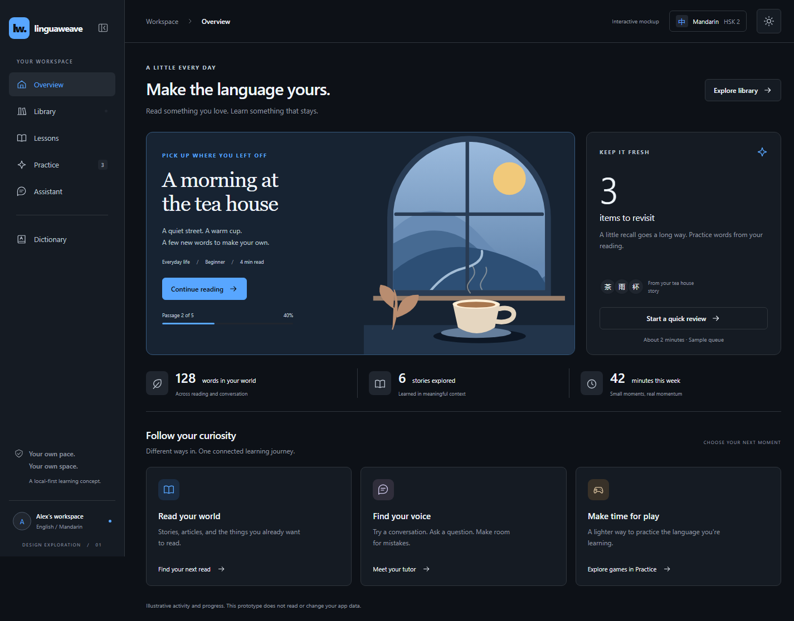

# Experience UI mockups

A professional, dark-theme direction for **LinguaWeave**, based on
[`ideas.md`](../ideas.md) and
[`language-learning-app-spec.md`](../language-learning-app-spec.md).
This is a design artifact, not a replacement for the current application.
Game mechanics from `games.md` are intentionally out of scope.

## Open the prototype

Open [`index.html`](index.html) directly in a browser. No build, dependencies,
account, or network connection is needed. With the repository's existing Vite
development server, navigate to `/docs/mockups/index.html`.

The prototype uses relative assets and hash navigation. For example,
`index.html#reader` opens Library's reading view directly, and
`index.html#lessons` opens the lesson collection. `index.html#games` opens
the Games section within Practice. `index.html#practice` opens the Exercises
chooser; `index.html#review` and `index.html#characters` open individual exercises.
`index.html#discover` opens the separate sample discovery shelf from Library.

Use the **Desktop / Mobile** controls above the app to switch between a fluid
desktop viewport and a phone viewport up to 390 by 844 pixels. The controls
resize the same iframe rather than reloading it, preserving the selected screen,
conversation and unsent drafts. On a smaller window, the phone preview
fits the available space. **Open app only** opens [`app.html`](app.html) without
the preview toolbar; it is also responsive on an actual phone.

LinguaWeave remains a **working name** while naming is explored. **Assistant**
is the navigation label for conversation, explanation, and practice help.

Use the button beside the desktop wordmark to **collapse the sidebar to icons**
or expand it again. Icon labels appear on hover or keyboard focus. The choice
stays in place across screens and Desktop / Mobile preview switches until reload.
In Assistant, the compact rail keeps Back to workspace, New conversation, and
Find a conversation; Find expands the pane and focuses the existing search.
Collapsing does not change the active conversation, drafts, or voice controls.
Mobile keeps its labeled bottom navigation, without a collapse button.

Icon controls have shared **hover and keyboard-focus tooltips**, including text
actions, reader controls, Assistant settings/dictation/Voice/Send, response menus,
and collapsed navigation. Labels follow the current action (for example,
Hear becomes Stop during playback). Tooltips stay within the viewport and appear
above scrolling panes and dialogs rather than being clipped. Move onto the tooltip
to keep reading it, or dismiss it with Escape. Touch taps still perform the normal
action without an extra tooltip-only tap.

## At a glance

| Desktop mockup | Desktop mockup | Phone mockup |
| --- | --- | --- |
| [Library](previews/library-desktop.png) | [Library: reading](previews/reader-desktop.png) | [Overview](previews/overview-mobile.png) |
| [Lessons](previews/lessons-desktop.png) | [Lesson preview](previews/lesson-detail-desktop.png) | [Lessons](previews/lessons-mobile.png) / [Lesson restart](previews/lesson-detail-mobile.png) |
| [Practice](previews/practice-desktop.png) | [Assistant](previews/conversation-desktop.png) | [Library: reading](previews/reader-mobile.png) |
| [Dictionary](previews/dictionary-desktop.png) | [Practice: games](previews/games-desktop.png) | [Practice](previews/practice-mobile.png) / [Games](previews/games-mobile.png) |
| [Conversation practice recap](previews/conversation-recap-desktop.png) | [Device preview](previews/device-preview.png) | [Assistant thread](previews/assistant-mobile.png) / [Conversation list](previews/conversation-list-mobile.png) |
| [Voice mode](previews/voice-mode-desktop.png) | | [Voice mode](previews/voice-mode-mobile.png) / [Composer controls](previews/assistant-controls-mobile.png) |
| [Review exercise](previews/review-desktop.png) | [Characters exercise](previews/characters-desktop.png) | [Review](previews/review-mobile.png) / [Characters](previews/characters-mobile.png) |
| [Shadow mode](previews/shadow-desktop.png) | [Shadow with Voice mode](previews/shadow-voice-desktop.png) | [Shadow](previews/shadow-mobile.png) / [Repeat after me](previews/shadow-repeat-mobile.png) |
| [New conversation](previews/new-conversation-desktop.png) | | [New conversation](previews/new-conversation-mobile.png) |
| [Assistant settings](previews/assistant-settings-desktop.png) | | [Assistant settings](previews/assistant-settings-mobile.png) |
| [Library import](previews/library-import-desktop.png) | [Append to a document](previews/library-append-desktop.png) | [Library import](previews/library-import-mobile.png) |
| [Imported document](previews/imported-document-desktop.png) | [Lesson import](previews/lesson-import-desktop.png) | [Lesson import](previews/lesson-import-mobile.png) |
| [Generated lesson preview](previews/lesson-generation-desktop.png) | [Imported lesson](previews/imported-lesson-desktop.png) | [Generated lesson preview](previews/lesson-generation-mobile.png) |
| [Library cards](previews/library-cards-desktop.png) | [Lesson cards](previews/lessons-cards-desktop.png) | [Library list](previews/library-mobile.png) |
| [Assistant response actions](previews/assistant-actions-desktop.png) | [Story creation preview](previews/assistant-creation-desktop.png) | [Response actions](previews/assistant-actions-mobile.png) / [Story preview](previews/assistant-creation-mobile.png) |
| [Assistant-created story](previews/assistant-story-library.png) | [Custom exercise](previews/assistant-exercise.png) | [Dictionary lookup](previews/dictionary-lookup-mobile.png) |
| [Dictionary learning set](previews/dictionary-learning-set.png) | [Assistant word lookup](previews/assistant-word-lookup.png) | [Learning set](previews/dictionary-learning-set-mobile.png) / [Scrolled learning set](previews/dictionary-learning-set-mobile-scrolled.png) |
| [Collapsed workspace sidebar](previews/sidebar-collapsed-desktop.png) | [Collapsed Assistant sidebar](previews/assistant-sidebar-collapsed-desktop.png) | |
| [Target reading with annotations](previews/reader-target-desktop.png) | [Discover](previews/discover-desktop.png) | [Target reading](previews/reader-target-mobile.png) / [Reading without word help](previews/reader-plain-mobile.png) |
| [Custom Library labels](previews/library-labels-desktop.png) | [Reading preparation request](previews/reading-preparation-desktop.png) | [Labels](previews/library-labels-mobile.png) / [Teach a selection](previews/reading-preparation-mobile.png) |
| [Lesson text actions](previews/snippet-lesson-desktop.png) | | [Word help actions](previews/snippet-reader-mobile.png) / [Dictionary actions](previews/snippet-dictionary-mobile.png) |
| | | [Selected text actions](previews/snippet-selection-mobile.png) / [Assistant text actions](previews/snippet-assistant-mobile.png) |
| [Assistant tooltips](previews/tooltip-assistant-desktop.png) | | [Reader tooltip in the compact layout](previews/tooltip-reader-mobile.png) |

These are static captures of the same HTML prototype, not separate designs.
Phone captures show a single viewport, including the fixed bottom navigation;
scroll in the interactive prototype to explore the rest of each screen.

## Screens and interactions

| Screen | Experience | Try it |
| --- | --- | --- |
| Overview | A reading-first home with a resume point, review queue, and alternate experiences | Continue the story, start practice, or choose an experience |
| Library | Browse, import, create, and read in one experience | Create a story with Assistant, import your material, or append sections; explore the sample reader and vocabulary |
| Lessons | Guided units introduce vocabulary and grammar together | Create a lesson with Assistant or import textbook text/images; review its vocabulary, grammar, and source |
| Practice | Exercises and Games share one practice space | Choose Review or Characters, create a custom exercise, or save a non-playable game level brief |
| Assistant | A learning partner and app-wide creation workspace | Use a reply's actions menu, review and save content, or look up words; continue Conversation, Shadow, dictation, and Voice mode |
| Dictionary | Shared lookup and a personal learning set | Look up characters, meaning, or pinyin; inspect a definition, add it to your learning set, and return to its source |

## Hear and Ask Assistant

Speaker and chat buttons accompany dictionary words and examples, learning-set
rows, reader word help, lesson vocabulary and examples, Review prompts/options,
the active character, Assistant phrases/messages/recaps, Voice-mode captions,
and imported or Assistant-created preview text. Decorative covers and navigation
glyphs are not pronunciation controls. Character pickers open the character's
controls; reader words open word help when that panel is enabled.

**Select target-language text** for a compact Hear / Ask toolbar anywhere in
readable content, including the reader with word help off. **Alt+Enter** moves
keyboard focus to those selection actions; Escape closes them. Reading annotations
and action controls are excluded from selected snippet text and teaching requests.

**Hear uses the browser's installed local voices**, not a recording or a speech
service. Only voices reported as local and matching the snippet's language are
eligible. Missing voices and playback errors produce visible, announced feedback;
there is no remote-voice or wrong-language fallback. Install an offline voice in
your device's speech settings if needed. Browser/platform voice availability varies.
Mandarin uses the speed in Assistant's settings gear; English stays at 1x.
Mixed-language preview text reads only its Mandarin fragments, not its English
explanation. This remains a fixed Mandarin profile, not automatic language detection
for arbitrary imports. Unclassified reading-preparation lesson excerpts do not
assume a pronunciation language.

Press the speaker again, use the playback strip's Stop button, or press Escape to
stop. A new playback replaces the previous one. Navigation, hiding the page, or
removing the playing snippet stops playback. Quiz blanks are spoken as "blank";
Hear never fills them or speaks a hidden answer. Voice-mode turns and dictation
remain simulations: only an explicit Hear action starts local speech.

**Ask Assistant prepares a fresh, editable draft** containing the exact snippet,
its source, and any supplied meaning. It does not submit, overwrite another draft,
change a learning state, choose a quiz option, or clear a character drawing.
Inside an unfinished dialog, it prepares the draft without closing the dialog or
discarding edits; finish or cancel, then open Assistant. **Remove context** in the
composer keeps the draft but returns it to a normal chat turn. Sending a snippet request
shows the supplied sample information, not an invented AI explanation.

## Visual direction

- Graphite and deep green surfaces, quiet borders, warm off-white text, and
  restrained citron accents. Lavender and sand distinguish secondary experiences.
- A compact workspace shell with a stable navigation hierarchy. Desktop has an
  expandable icon rail; narrower desktop windows default to icons outside
  Assistant unless a choice has been made. Phones use a horizontally scrollable,
  labeled bottom navigation bar. The mobile workspace scrolls within the area
  above that bar, so its scrollbar never runs beside or behind the toolbar.
  Safe-area space remains reserved for the home indicator. Desktop pages keep
  normal document scrolling; navigation resets the appropriate scroll container.
- System sans-serif typography for controls; editorial serif typography for
  reading and featured content. Native script stays prominent, with romanization
  available where it helps.
- A viewport-sized e-reader with a quiet page, a comfortable text measure, and
  adjustable text size. The page scrolls independently of its controls. On phones,
  compact word help docks immediately above navigation, without moving the page
  when a word is selected. Extra details scroll within the bounded panel.
- Original vector illustration and CSS cover artwork, with no remote fonts,
  images, scripts, or media dependencies.
- Visible keyboard focus, a skip link, native dialogs, labeled controls,
  announced feedback, and reduced-motion support.

## Library and Lessons

Both catalogs default to a **compact list** instead of large covers or thumbnail
cards. **List / Cards** controls switch the layout without replacing the items.
Library rows retain reading status, progress, and import/append actions;
lesson rows show their topic, title, vocabulary/pattern counts, and an Open action.
On phones, lesson descriptions give way to the essential details.

Each catalog remembers its own layout until reload. Switching views or device
sizes preserves filters, imports, and navigation state. Newly imported documents
and lessons use the selected layout automatically.

Library is **one list**, with no Imported or topic category tabs. Items can carry
multiple labels, including topics, origins, and custom names. An item's **Labels**
button opens a multi-select editor where new labels can be created. Save applies
the changes; Cancel leaves both the item and label collection unchanged. Label
names are deduplicated without regard to case. Filters match **all** selected
labels together with the title search.

Imported and Assistant-created documents receive useful initial labels, but
labels do not determine provenance or whether a document supports appending.
Appending or re-rendering the catalog keeps custom labels. **Discover** opens a
separate browsing screen from Library and keeps Library selected in navigation.
The original sample shelf is not mixed into label filtering.

**Library owns reading.** There is no separate Reader navigation item. Opening
a story keeps Library selected in desktop and mobile navigation, with a
reading header and a **Back to Library** link. Returning preserves
search and label filters. Existing `#reader` links remain valid
for resume links and reading context from Dictionary, Practice, and Lessons.

**Lessons** is a separate top-level destination for guided vocabulary and grammar
units, rather than recall practice. Three authored previews cover simple requests,
tomorrow's plans, and asking for locations. Each provides a learning objective,
an example with romanization and meaning, vocabulary, a reusable pattern, and a
link to the matching Assistant conversation. The request lesson also links to
its companion Library story.

Lessons are freely selectable. This design does not decide prerequisites or a
fixed course sequence, run live lesson generation, or record completion/mastery. **Practice**
remains the separate place to revisit material through exercises and future games.
Every opened lesson has a sticky **Start from beginning** action, including
imported and Assistant-created lessons. It returns to the opening material and
closes source details, without resetting learning-set membership or learned words.
These are currently single-page previews, not scored multi-step lesson runs.

### Reading and word help

The reading language is either **Source** (English) or **Target** (Mandarin).
**Weaving** is an independent on/off switch, not a density slider:

| View | Weaving off | Weaving on |
| --- | --- | --- |
| Source | Original English text | Learning-set words use their authored Mandarin counterparts |
| Target | Mandarin text without annotations | Words not yet learned get small pronunciation and English-meaning annotations below them; learned words stay unannotated |

Target annotations are not limited to learning-set membership. The sample
lexicon covers passage words beyond the original learning set. English function
words with no isolated Mandarin equivalent stay unchanged in Source weaving,
with an explanation available in word help.

**Learning panel** is independent of language and weaving. When active, any
passage word can be selected for meaning, pronunciation, status, and **Add to
learning set**. When off, the text remains readable and selectable without opening
word help. The prototype uses **Not studied / Practicing / Learned** as visible
statuses. Marking a word learned does not automatically add it to the learning set.
Dictionary lookup and Assistant share these statuses and membership changes.

The phone panel shows the selected term, meaning, status, and Add action in a
compact dock. **Example & more** expands within that dock rather than pushing
the reading page away. The pinned header contains the panel toggle and reading
preparation icon; **Aa / Aa+ / Aa++** changes text size.

### Teach me to read this

Library items have a **Teach me to read** action. Opened documents also offer
**Teach this section**, and the reading header's practice icon can prepare the
whole material or a text selection. Select words in the reader, then use that
icon; annotations are excluded from the captured source. In Source weaving,
the request retains the original English words rather than the inserted forms.

Choose **Whole text**, **Chapter / section**, or **Selected text**. The dialog
shows the exact material and its language. Known sample languages are prefilled;
an import whose language is unspecified asks for it. This requests vocabulary
and grammar teaching so the user can read the material in that language, not a
translation of it.

Confirming opens a fresh Assistant thread with an editable request and a snapshot
of the source and scope. Other conversations' drafts are preserved. Sending the
request produces a clearly labeled preparation preview, which can be saved in
Lessons with its source context. It is **not** a generated curriculum or a claim
to have assessed the user's knowledge. No generic Mandarin lesson is substituted
for a request to learn to read English or another language.

### Import your own material

| Destination | Formats | Flow |
| --- | --- | --- |
| Library | Pasted text, UTF-8 `.txt`, Markdown (`.md` / `.markdown`), EPUB, or one or more images | Choose material, review and edit the source, then add a document or append to an existing import |
| Lessons | Pasted text, UTF-8 `.txt`, or one or more images | Choose textbook material, review the extracted source, preview a generated lesson, then add it to Lessons |

Library imports appear in the unified catalog with an initial **Imported** label. Each document retains
its ordered import sections, format, file names, and optional source/page
reference. **Append material** is available on its list row, card, and detail view;
the main Import dialog also offers an existing-document destination. New
material is added after the existing sections without replacing them. You can
bring in a few pages now and add more later. Built-in sample stories are not
append destinations.

An original **Everyday Mandarin (sample import)** document starts with one
illustrative section so appending is immediately explorable. **Try original
sample material** can populate any source format without selecting local files.
The append sample demonstrates the next unit rather than repeating the first.
The import dialog keeps its heading and bottom actions visible while the
material scrolls independently, including on phones.

Text and Markdown files are read locally, and their source is retained.
The basic source preview renders headings and paragraphs, not full Markdown,
HTML, or a translated learning reader. Imported HTML is displayed literally.
Image extraction and EPUB conversion show clearly labeled original sample
content rather than claiming to process the selected files. The review is
editable before anything is added. Canceling does not change the Library
or Lessons; changing a source invalidates its earlier conversion preview.

Lesson import is intended for pages from a textbook or other material the
learner owns. The source reference travels with the lesson, and its reviewed
text remains available under **Imported source**. The generation step previews
an objective, vocabulary, a grammar pattern, and an example. In this mockup,
those fields use the authored request lesson and are explicitly **not generated
from the uploaded material**. Imported lessons are selectable alongside the
original lessons and do not create Library documents.

The intended connected flow is image-to-structured-text extraction, followed by
human review, then either Library storage or lesson generation. EPUB conversion
also feeds the Library review step. This prototype performs no AI calls, image
recognition, EPUB parsing, uploads, or persistent storage. Only the reviewed
preview content and source metadata are kept in memory until reload.

## Practice and Games

**Practice contains Exercises and Games.** Exercises opens a chooser, not a
review session. **Review** and **Characters** are individual exercise types;
both keep Exercises selected and offer an **All exercises** link.

**Review** retains contextual recall, hints, and the three-question summary.
The Overview quick-review and Dictionary review links open it directly.
Switching exercises or visiting Games preserves the question, answer, hints,
and results without restarting the review.

**Characters** is for writing individual characters, not composing sentences.
Choose a sample character (tea, rain, or cup), draw with a finger, pen, or mouse,
toggle the visual guide, undo a stroke, or clear the drawing. A keyboard
alternative lets users type the character. Each character's drawing and typed
response survive navigation and device resizing in this page, but reset on
reload. The guide is a reference glyph, not stroke-order instruction; there is
no handwriting recognition, evaluation, or mastery score.

The existing `#games` link and Overview's play shortcut open the Games section.
**Explore exercises** returns to the exercise chooser.

Games remain a non-playable concept. Assistant can create and save a custom
level's content brief, but this does not introduce game types, mechanics,
scoring, or progression from `games.md`. Custom exercise previews offer an
unscored answer reveal, separate from the fixed Review queue.

## Dictionary: lookup and learning set

**Look up** searches the authored sample lexicon by characters, English meaning,
or pinyin. Tone-marked, numbered, and unmarked pinyin work: `gōngyuán`,
`gong1yuan2`, and `gongyuan` find the same entry. Spacing and case are normalized.
Results show pronunciation, meaning, and an example before **Add to learning set**.
Unknown words produce an explicit sample-dictionary limitation, not an invented
definition.

**My learning set** contains only words the learner has chosen to track. Its
search and learning-state filter remain available. Lookup itself does not add
words. Adding a word does not mark it learned or enqueue it in the fixed demo
review. Duplicate additions are disabled without resetting progress or source.

Assistant uses the same lookup and Add action. Entries added there link back to
their source conversation; direct lookup additions return to their dictionary
entry. Reader additions keep their reading context. Nothing is persisted.

## Assistant conversations

A **conversation** is one continuing thread around a topic or goal, with its
own transcript and unsent draft. Open it and keep talking: there is no separate
start, end, or session-management step. Earlier messages remain in the same
scrollable transcript. The initial examples cover reading assistance,
free conversation, grammar explanations, and everyday roleplay.

**New conversation** opens a fresh chat immediately and focuses the message
input. There is no topic or style dialog to complete first. It starts as
**New conversation**, then takes a short excerpt of the first user turn as its
title; this is a local text preview, not AI-generated naming. Unsent drafts do
not set the title, and later messages do not rename the conversation.
New chats start in Conversation mode; Shadow can be applied at any time.

### App-wide tasks and response actions

| Entry point | Destination |
| --- | --- |
| Library: **Create story**, beside Import | A story in the normal Library list |
| Lessons: **Create lesson**, beside Import lesson | A lesson in the normal Lessons list |
| Practice / Exercises: **Create exercise** | A custom exercise above the built-in exercises |
| Practice / Games: **Create level** | A custom level content brief, not a playable game |
| Dictionary: **Ask Assistant**, or a lookup result's Ask action | Shared word lookup and explicit Add to learning set |

These contextual buttons open a fresh Assistant thread with the destination and
an editable request already selected, preserving drafts in other conversations.
The thread is not named until its first message is sent. There is no separate
AI-content collection: approved content appears alongside existing material and
respects the destination's current List / Cards view.

Every Assistant reply has a small **actions icon at its lower-left, inside the
reply bubble and below its content**. It opens a non-modal actions popup.
Choosing a task uses that response as context for the next request in the same
thread. Existing drafts and recordings are not overwritten. Escape, outside
clicks, navigation, and thread changes dismiss the popup; it fits the viewport
and scrolls internally on short screens.

Requests carry an explicit task intent, separate from Conversation / Shadow.
**Cancel task** preserves the draft as a normal chat turn. A task does not
change Shadow's mode, pending repetition, or voice preview. Ordinary Shadow
utterances are never interpreted as app commands. In Conversation mode, simple
creation prefixes and `Look up ...` or `Add ... to my learning set` can also
demonstrate the flow without first using a contextual button.

Content tasks show a review card with a sample familiar-vocabulary plan and
learning targets. Stories can be expanded before saving; lessons show an
objective, phrase, vocabulary count, and grammar pattern. **Add** changes the
target collection only once; **Discard preview** changes none. **Open in...**
then navigates to the saved item. Requests, response context, and a link to the
source conversation remain available with the saved content.

Assistant stories are not imports and do not become append destinations.
Dictionary lookup is retrieval from the shared sample lexicon, not content
generation; its word cards offer **Add to learning set** directly.

**Simulation boundary:** each content type uses an original authored fixture.
The request is retained but does not drive live generation or an actual
familiarity/grammar assessment. A connected implementation should read the
learning profile and requested goals, draft structured content, and use
destination-specific app operations after approval. These operations are
separate from conversational mode instructions; imported text and quoted
response context remain data, not app-operation instructions. No model,
dictionary service, game engine, or persistent storage is connected here.

On desktop, entering Assistant **replaces the workspace sidebar** with a searchable
list of conversations and a **New conversation** button. It does not add a second sidebar.
**Back to workspace** restores the standard navigation and returns to the last
workspace screen, or Overview when Assistant was opened directly.

On mobile, the **same bottom navigation stays visible on every screen**, including
Assistant. Tapping Assistant shows the conversation list in the main page.
Selecting a conversation opens its transcript; the **All conversations** back arrow returns to
the list within the page. Tapping the Assistant tab again also returns to the
list. There is no mobile workspace/Assistant toolbar swap.

The picker moves between the desktop sidebar and mobile main page without
duplicating its state. Resizing an open chat preserves the selected conversation
and draft. Content and notices sit above the navigation and device safe area.
The external Desktop / Mobile preview controls remain above the prototype;
they are not part of the app navigation.

Drafts stay separate when switching conversations. Switching away during a
simulated voice recording stops that turn into a reviewable draft in its
original conversation. The demo still does not access a microphone or persist
anything across reloads.

The message input, dictation, and Voice mode controls are **docked to the bottom
of the Assistant viewport**, above the bottom navigation on mobile. They are
visible as soon as a conversation opens, without scrolling the page. History,
sample voice replies, and expanded practice recaps scroll independently above
the dock. On short viewports, the conversation header joins that scroll area
to keep the input and active voice controls available. The layout follows the
visual viewport when the mobile keyboard changes the available space.

The **settings gear beside the dictation microphone**, inside the input bubble,
opens a non-modal popup for Assistant mode, Mandarin speech speed (0.5x, 0.75x,
1x, or 1.25x), and romanization. These controls no longer occupy a toolbar above
the transcript. Changes apply immediately without sending or clearing a draft.
Speech speed applies only to the target language; English stays at normal speed.
Romanization changes the transcript, Shadow practice prompts, practice recap,
and Voice mode captions consistently.

The popup uses the browser's native popover behavior: Escape, an outside click,
the gear, or its close button dismiss it. It normally opens above the input,
repositions with the viewport, and scrolls internally when keyboard-constrained
space is short. It closes when switching conversations, opening a new chat,
returning to the mobile list, or leaving Assistant. Opening settings does not
stop dictation or Voice mode. The input remains docked and Shadow's active
intent stays visible in the composer when settings are closed.

### Conversation and Shadow modes

The **Conversation / Shadow** selector in Assistant settings changes behavior for the next turn in
the current conversation. Each thread keeps its own mode. Switching adds a
small marker to the transcript without rewriting earlier messages, clearing
the draft, or starting a new conversation. The picker identifies Shadow threads
and can find them by searching for "shadow."

Shadow reflects a supported sample utterance in Mandarin, with optional
romanization, its English meaning, and a short explanation. **Repeat after me**
sets the next input's intent to repetition and shows a model phrase in the
scrollable history. **Explain more** adds an authored explanation for that
specific phrase, without sending or replacing an unsent draft. **Say something
else**, or **New phrase** in the composer, returns to shadowing a new utterance.
After submitting a repetition, the next input returns to new-phrase shadowing.
The composer identifies whether the next turn is a new phrase or a repetition.

**Samples** offers three authored utterances about tea, tomorrow's plans, and
the station. Selecting one fills an empty draft; Send remains explicit.
Unrecognized text stays in the transcript with an explanation of the demo's
limits rather than receiving an unrelated "translation." Use the follow-up
actions for repetition and explanation; this prototype does not interpret
arbitrary spoken commands or grade pronunciation.

Shadow is independent of **Voice mode**. Switching behavior does not stop an
active or paused Voice mode preview. A sample response already on screen keeps
its original behavior; the new mode applies to the next preview turn.
Shadow voice captions offer the same follow-up actions. Dictation still needs
review and Send; its sample transcript is chosen when recording starts, so
changing mode mid-recording cannot rewrite the simulated utterance.

**Implementation direction, not a connected service:** the mockup stores
`mode` and `shadowIntent` on the conversation and tags new turns with their
mode and intent. Mode markers are UI events, not historical system messages.
A future request builder should combine common Assistant instructions with
the selected mode's instruction template and the explicit turn intent.
Request-based APIs can receive those instructions on the next request;
persistent/realtime providers need their supported update mechanism or a
replacement model session that retains context. No provider-specific system
instruction updates, AI calls, or microphone access are implemented here.
Explicit Hear actions can use an installed local speech voice.

Three **icon-only controls sit beside the text box**, inside the docked input:
the microphone for dictation, the settings gear, and a shared Voice mode / Send action. With an
empty or whitespace-only draft, the shared action shows a waveform. Entering
text changes that same button into an upward Send arrow; clearing or sending
the draft restores the waveform. Tooltips and accessible names follow the action,
and all three icons retain 44-pixel touch targets.

The composer separates **dictation** (record a sample turn, review the text,
then send) from **Voice mode** (hands-free conversation).
Voice mode toggles a compact **inline panel in the
composer**, with turn status, pause/resume, and an end button. Sample replies
appear in the scrollable history rather than expanding the dock.
Voice mode itself uses no dialog, overlay, or focus trap: the transcript, text input,
navigation, and settings gear remain available in place.
Toggle Voice mode again or use **End voice mode** to stop. Leaving the
conversation also ends it; resizing the preview preserves it. The intended connected
experience would listen and reply without pressing Send each turn; this mockup
uses explicit preview steps, never accesses a microphone or automatically plays audio, and
does not add messages or change a typed draft through preview steps. Explicit
Shadow explanation actions do add the requested explanation to the transcript.

**What you've practiced** is an optional recap for the whole conversation:
vocabulary encountered, reusable patterns, and something to try next. Sample
recaps are authored examples, not automatic mastery judgments. New conversations
count actual demo replies but do not fabricate extracted vocabulary.

Advanced learning logs and AI request/context history remain out of scope.

## Relationship to the experience documents

| Source | Mockup decision |
| --- | --- |
| App specification: core workflow and sample content | Resume meaningful reading; support pasted text alongside sample discovery; retain source attribution |
| Reading feedback, refining the experience specification | Source or Target, independent binary weaving, and independent word help; Target annotations only for words not yet learned |
| Ideas: curriculum organized into lessons; app specification: vocabulary and phrase teaching | A Lessons destination with authored units combining vocabulary, grammar, examples, and related conversation or reading |
| Navigation feedback | Reading is a detail view within Library, not a separate top-level destination |
| Import feedback | Library imports support incremental document sections; textbook text/images can become lesson previews after source review |
| App-wide Assistant feedback | Contextual creation buttons and reply actions prepare explicit tasks; approved samples enter the normal collections with conversation provenance |
| Dictionary feedback | Lookup and learning-set membership are separate; direct lookup and Assistant share definitions, search normalization, and duplicate-safe Add actions |
| Reading preparation feedback | Request vocabulary and grammar teaching for a whole text, chapter/section, or selection, retaining original material and its language |
| Library organization feedback | Multi-label items and custom labels replace exclusive categories; Discover remains a separate browsing screen |
| Lesson restart feedback | Start from beginning remains available without clearing learned vocabulary |
| App specification: learning states and spaced repetition | Show contextual review, distinguish hints from unaided recall, and keep word state visible |
| Ideas: conversation / voice mode | Composer settings for mode, target-speech speed, and romanization; separate dictation and hands-free Voice mode entry points |
| Conversation design feedback | Continuous transcripts and optional practice recaps; a contextual desktop sidebar, or a mobile main-page picker above the unchanged bottom navigation |
| Shadow mode feedback | Per-conversation behavior changes with explicit shadow, repeat, and explain intents, separate from voice input/output |
| Ideas: activities; exercise design feedback | Exercises offers Review and Characters, separating recall from individual character writing |
| User direction: merge Games into Practice | Exercises and Games share Practice, without importing game details |

## Deliberate boundaries and open decisions

Seeded content, metrics, progress, and tutor replies are **sample data**. The language
profile is a fixed English-to-Mandarin example; language switching is not
implemented. The three sample stories and artwork are original to this mockup.
The tea house reader shows one passage of an illustrative five-passage story,
not a complete book.

Navigation, search, filters, reading modes, word inspection, dictionary changes,
review feedback, import/review/append flows, character drawing, conversations, contextual navigation, dialogs, device preview,
and dictation / Voice mode **simulations** are interactive. Changes
exist in memory and disappear on reload. The mockup does not read or write
application storage, make network requests, access a microphone,
translate pasted content, or run an AI service. Selected text/Markdown files are
read locally; imported preview content is not saved across reloads. Avoid
entering sensitive text. Explicit Hear actions are the exception to simulated
audio: they use only matching, installed local browser voices.

The three-question practice queue and Overview metrics stay fixed. Adding a word
updates the sample Dictionary and applicable weaving, not that demonstration
queue. Reading uses an authored bilingual lexicon and local membership/learned
flags, not production alignment or knowledge inference. Reading preparation
retains source context but does not generate vocabulary or grammar teaching.

The experience specification uses **Unseen / Introduced / Practicing / Learned /
Mastered**; the existing normative `specs/app.md` uses **Learning / Familiar /
Mastered** for tracked items. This iteration uses **Not studied / Practicing /
Learned** in word help without changing production contracts. Harmonizing that vocabulary is a follow-up design
decision, not a migration implied by these mockups.

Wikipedia, Gutenberg, live extraction/generation, recording playback,
real hands-free operation, adaptive scheduling, and full history inspection
remain outside this prototype. Video learning is not expanded in this pass.
Scanned material and generated lessons are represented only by the import previews above.
The screens are exploratory, not an assertion that every illustrated feature is
already available.
