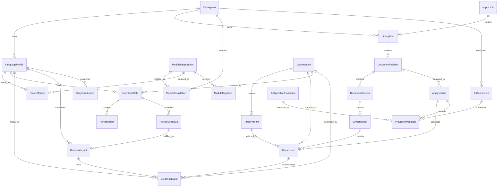

# Top-Level Data Model

## 1. Purpose

This specification defines the application-wide data model and ownership boundaries. It is logical and independent of IndexedDB or a future server database. Physical schemas MAY refine names and indexes but MUST preserve these identities, relationships, workspace scope, and versioning guarantees.

Module-specific data is defined by each module and linked to core entities through stable IDs. Modules MUST NOT duplicate or privately redefine core identity, content, learning, evidence, or review records.

For the MVP, each aggregate is persisted in versioned IndexedDB object stores behind typed repositories. The repository contracts MUST avoid IndexedDB-specific types so future remote and synchronized implementations can preserve the logical model.

## 2. Entity relationship overview

## 3. Identity and ownership

### `Workspace`

Represents one local installation's private data boundary. It is the aggregate root for the client-side MVP and becomes associated with an authenticated account when synchronization is introduced.

Required properties:

- Stable ID
- Schema version
- Display and locale preferences
- Timezone
- Created and updated timestamps
- Optional future synchronization metadata

### `LanguageProfile`

Represents one workspace's learning context for one source and target language pair.

Required properties:

- Workspace ID
- Source language
- Target language
- Script preference
- Romanization preference
- Default daily new-item limit
- Active state

The MVP uses English as the source language. A workspace MAY have multiple profiles, including multiple profiles for the same target language, but their learning state remains separate.

### `ModuleRegistration`

Represents a module discovered from the generated build registry.

Required properties:

- Stable module ID
- Installed semantic version
- Core contract range
- Manifest digest
- Enabled/compatible state

This record is operational metadata, not the source of the manifest. The compiled manifest remains authoritative.

### `ModuleInstallation`

Represents a module's workspace-level availability and lifecycle state.

Required properties:

- Workspace ID
- Module ID
- Enabled/disabled state
- Installed and disabled timestamps

Disabling a module MUST preserve its data unless deletion is explicitly requested.

### `ProfileModule`

Represents a module enabled for a specific language profile.

Required properties:

- Language profile ID
- Module ID
- Versioned, schema-validated settings
- Enabled state

Settings are stored through the owning module's typed repository and validated against its manifest schema.

## 4. Content

### `LibraryItem`

Represents a user-visible imported work.

Required properties:

- Workspace ID
- Title and optional author
- Source type: paste, text, Markdown, EPUB, or URL
- Original object reference or source URL
- Import status
- Attribution metadata
- Current document revision ID

### `DocumentRevision`

An immutable normalized version of a library item.

Required properties:

- Library item ID
- Revision number
- Importer ID and version
- Source content digest
- Normalization metadata
- Created timestamp

Reimporting or renormalizing content MUST create a new revision.

### `DocumentSection`

Represents ordered structural content such as an EPUB chapter or article section.

Required properties:

- Document revision ID
- Stable section key
- Position
- Optional heading

### `ContentBlock`

Represents the smallest stable analyzable and renderable source unit, such as a paragraph or heading.

Required properties:

- Section ID
- Stable block key
- Position
- Block type
- Original normalized text
- Content digest

Source offsets used by occurrences are relative to an immutable content block.

### `ImportJob`

Tracks extraction and normalization of one source.

Required properties:

- Workspace ID
- Idempotency key
- Source type and safe source reference
- Status and current stage
- Importer ID and version
- Structured failure code and details
- Attempt timestamps

## 5. Shared learning model

### `LearningItem`

Represents a canonical source-language concept or construction.

Required properties:

- Stable ID
- Source language
- Canonical source representation
- Item type: word, phrase, idiom, construction, or sentence pattern
- Normalized lexical or construction metadata
- Provenance

A learning item is not owned by a module. Multiple modules MAY produce evidence for the same item.

### `TargetVariant`

Represents one accepted target-language realization of a learning item.

Required properties:

- Learning item ID
- Target language and script
- Native form
- Romanization
- English gloss
- Lexical or construction metadata
- Context constraints
- Language-pack ID and version
- Dictionary or user-correction provenance
- Validation state

### `Occurrence`

Represents one contextual mapping in a document block.

Required properties:

- Content block ID
- Learning item ID
- Target variant ID
- Start and end source offsets
- Source text snapshot
- Confidence and validation state
- Analysis run ID
- Optional superseding correction ID

Occurrences MUST be versioned or superseded, never silently rewritten after evidence refers to them.

### `UserItemState`

Represents the current derived state of one learning item for one language profile.

Required properties:

- Language profile ID
- Learning item ID
- Visible tier: Learning, Familiar, or Mastered
- Internal confidence
- First introduced and last evidenced timestamps
- Derivation algorithm version
- Optional manual override

The unique identity is the language-profile and learning-item pair. This record is created only when the learner or a module introduces the item. An analyzed candidate without this record is untracked: it has no tier and does not appear in Dictionary.

This record is a projection; immutable evidence remains authoritative.

### Dictionary projection

Dictionary is a core application view, not a separate persistence aggregate or module. Its item list is the join of:

- The selected language profile
- Existing `UserItemState` records
- Their `LearningItem` and accepted `TargetVariant` records
- Current `ReviewSchedule`
- Summaries derived from evidence, tier transitions, corrections, and source modules

The projection MUST NOT infer a Dictionary entry from an occurrence or analysis candidate alone.

### `TierTransition`

Records every visible tier change.

Required properties:

- User-item state ID
- Previous and next tier
- Automatic or manual cause
- Explanation metadata
- Evidence or actor reference
- Timestamp

### `DailyIntroduction`

Records consumption or override of a profile's daily new-item budget.

Required properties:

- Language profile ID
- Learner-local date
- Learning item ID or override event ID
- Amount
- Idempotency key

The unique constraints MUST prevent the same introduction from being charged twice.

## 6. Evidence and review

### `EvidenceEvent`

An immutable statement about learner interaction or recall.

Required properties:

- Globally unique event ID
- Language profile ID
- Learning item ID
- Optional occurrence ID
- Source module ID
- Evidence type and strength
- Client occurrence time and server receipt time
- Payload schema version
- Idempotency key

Evidence events are the authoritative input to confidence, tier, and schedule projections. Corrections to processing MUST rebuild projections rather than mutate historical events.

### `ReviewSchedule`

Represents the current derived schedule for an item.

Required properties:

- User-item state ID
- Due timestamp
- Stability, difficulty, or equivalent scheduler parameters
- Last review timestamp
- Scheduler algorithm version

### `ReviewAttempt`

Records one completed or abandoned review prompt.

Required properties:

- Language profile ID
- Learning item ID
- Review activity ID
- Prompt and accepted-answer version references
- Normalized result
- Started and completed timestamps
- Source module ID

Each completed attempt MUST emit one or more evidence events exactly once.

## 7. Analysis and operations

### `AIConnection`

Represents a workspace's locally saved OpenAI-compatible provider configuration.

Required properties:

- Workspace ID
- Display name
- Normalized API base URL
- Model identifier
- API key stored in IndexedDB
- Configuration version
- Enabled state
- Last connection-test status and timestamp
- Last four characters or another non-secret configured indicator, if shown
- Created and updated timestamps

The API key is available only to the core browser provider adapter. It MUST NOT be stored in localStorage, logged, cached by the service worker, or included in default backup exports. Client-side encryption MUST NOT be represented as secure secret storage.

The MVP uses one active default connection per workspace. The model permits additional named connections later without changing provider invocation records.

### `AnalysisRun`

Tracks analysis of one document revision for a target language and capability set.

Required properties:

- Document revision ID
- Language profile or target-language context
- Requesting module ID
- Analysis-provider ID and version
- Language-pack ID and version
- Prompt or ruleset version
- Status, confidence summary, and failure information

### `ProviderInvocation`

Records an external analysis call for audit, cost, and retry behavior without storing provider secrets.

Required properties:

- Analysis run ID
- AI connection ID and configuration version
- Provider and model identifiers
- Request digest
- Usage and cost metadata
- Status, latency, and failure code

Provider invocations MUST NOT contain the API key or request/response bodies that expose imported content by default.

### `AIOperationInvocation`

Records one call to a curated AI operation through the active transport.

Required properties:

- Workspace ID
- Requesting module ID or core caller
- Stable operation ID and version
- Input and output schema versions
- Authorization decision
- Status and sanitized failure code
- Idempotency key where the operation permits retries
- Started and completed timestamps

The record MAY reference one or more provider invocations. It MUST NOT store secrets. Raw inputs or outputs containing user content are excluded by default and require an explicit operation-level retention policy.

### `ModuleMigration`

Tracks application of a module-owned persistence migration.

Required properties:

- Module ID
- Migration version and digest
- Applied timestamp
- Success state

### Jobs and future synchronization

Browser jobs and mutations MUST carry globally unique idempotency keys. Job payloads MUST include their schema and producer versions. The future synchronization adapter resolves immutable-event conflicts by deduplication and mutable-record conflicts through explicit version checks.

## 8. Module-owned data

Modules MAY add namespaced entities that reference core IDs. The Reading module is expected to own records such as:

- Reading position and completion per document/profile
- Bookmarks containing document, chapter, and relative scroll position
- Offline download state
- Active reading technique per profile or document
- Cached structured immersion translations per chapter
- Diglot weave planner version and per-document plan
- Learner-pinned occurrence decisions
- Reading-specific correction workflow state

These entities belong in the Reading module's migrations and repositories. They MUST NOT be added to core merely because Reading is the first module.

The Conversation module is expected to own records such as:

- Conversation thread and title
- Ordered user, assistant, and system-visible message records
- Message generation and retry state
- Canonical assistant content
- Versioned technique annotation plans
- Per-conversation language profile and settings

Conversation records reference core AI-operation invocations, learning items, and evidence by stable ID. Provider credentials and provider-specific request bodies remain core-owned.

## 9. Global invariants

- Every private aggregate is directly or transitively owned by one local workspace.
- IndexedDB schema upgrades MUST be versioned and atomic where the platform permits.
- Backup exports MUST include schema and application versions.
- Source documents, analyses, variants, occurrences, evidence, and algorithms are versioned.
- Historical evidence and completed review attempts are immutable.
- Derived state identifies the algorithm version that produced it and can be rebuilt.
- Modules reference core records by stable IDs and never bypass typed core services.
- Deleting local data removes the IndexedDB databases, Cache Storage entries, and service-worker-held application data.
